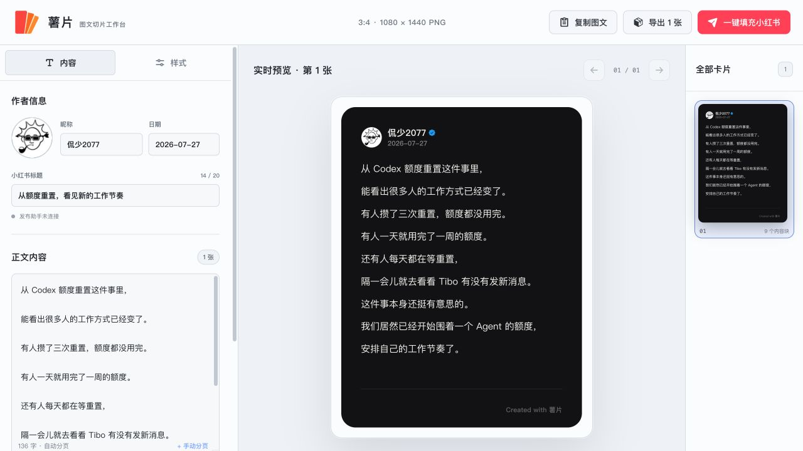

# 薯片

把长文和图片切成一片片 3:4 小红书卡片，再把标题、正文和图片辅助填入小红书创作后台。

[在线使用](https://www.kanshao2077.cn/shupian/) · [下载浏览器插件](https://github.com/kanshao2077/shupian/releases/latest/download/shupian-xhs-assistant.zip)



## 它能做什么

- 长文自动分页，生成 1080 × 1440 的 3:4 卡片。
- 短句一键生成 3:4 海报，可选“材质大字”或“重点摘录”两种样式。
- 短句最多 80 个可见字符、8 行，字号会按实际行距、字距和容器空间平滑缩放。
- “材质大字”可上传自定义背景，自动居中裁成 3:4，并记住在当前浏览器中。
- 添加任意比例图片，默认按 16:9 居中裁切，也可切换回原图比例。
- 文字和图片在同一个编辑区混排；光标放到任意位置，直接粘贴图片即可插入。
- 左侧总稿支持整篇编辑与一键清空；右侧当前卡片正文可以整段直接修改，空行会原样保留，离开后自动重新分页。
- 图片可在图文顺序中上下移动，也能随时切换 16:9、原图、4:3 或 1:1。
- 自定义头像、昵称、日期、背景、字号、行距和字距。
- 长文卡片底部标识可在“X”与“自定义文字”之间二选一，统一显示在右下角。
- 一键复制标题和正文，一键打包下载全部卡片。
- 配合浏览器插件，把标题、正文和卡片图填入小红书后台。
- 自动跟随系统切换亮色和暗色界面。

## 最简单的使用方法

1. 打开[在线版薯片](https://www.kanshao2077.cn/shupian/)。
2. 先选“长文卡片”或“短文海报”。短文只要写一句话，再选喜欢的样式即可。
3. 长文模式下可修改标题、作者信息和正文；把光标放到目标位置，直接粘贴或添加图片。
4. 在“样式”里调整背景、圆角、字号、行距、字距和文字颜色。“材质大字”的背景可在“内容”页直接更换。
5. 点击“导出”下载全部卡片，或安装下面的插件后点击“一键填充小红书”。

## 安装小红书发布助手

目前插件需要手动安装一次，支持 Chrome 和 Edge。

1. [下载插件压缩包](https://github.com/kanshao2077/shupian/releases/latest/download/shupian-xhs-assistant.zip)。
2. 解压下载的 ZIP 文件，里面会有一个 `browser-extension` 文件夹。
3. Chrome 打开 `chrome://extensions/`；Edge 打开 `edge://extensions/`。
4. 打开右上角的“开发者模式”。
5. 点击“加载已解压的扩展程序”，选择刚才解压出的 `browser-extension` 文件夹。
6. 刷新薯片网页。作者信息下方显示“发布助手已连接”，就说明安装成功。

之后在薯片里完成图文，点击“一键填充小红书”。插件会打开小红书创作后台并尝试填入卡片、标题和正文。请先校对，最终的“发布”按钮仍由你自己点击。

## 隐私与安全

- 网页没有账号系统和后端，编辑内容只在当前浏览器页面中处理。
- 自定义海报背景会压缩后保存在当前网站、当前浏览器中，不会上传到服务器。
- 插件只把待发布素材临时保存在浏览器本地。
- 插件不会点击小红书的“发布”或“定时发布”按钮。
- 小红书后台结构变化时，自动填充可能失效；插件会提示你手动检查，不会继续误操作。

## 本地运行

需要 Node.js 20 或更高版本。

```bash
npm install
npm run dev
```

然后打开 `http://localhost:4173/`。

构建正式版本：

```bash
npm run build
```

运行项目自带检查：

```bash
npm run test:sites
```

## 自动部署

推送到 `main` 分支后，GitHub Actions 会自动构建并更新 GitHub Pages。部署配置在 `.github/workflows/pages.yml`。

## 已知限制

- GitHub Pages 和 GitHub 文件下载在中国大陆的速度与稳定性无法保证。
- 浏览器插件暂未上架 Chrome 应用商店，因此需要按上面的步骤手动安装。
- 自动填充依赖小红书创作后台的页面结构，后续可能需要随小红书更新。
- 自定义海报背景不会跨设备、跨浏览器或在本地版与在线版之间同步。
